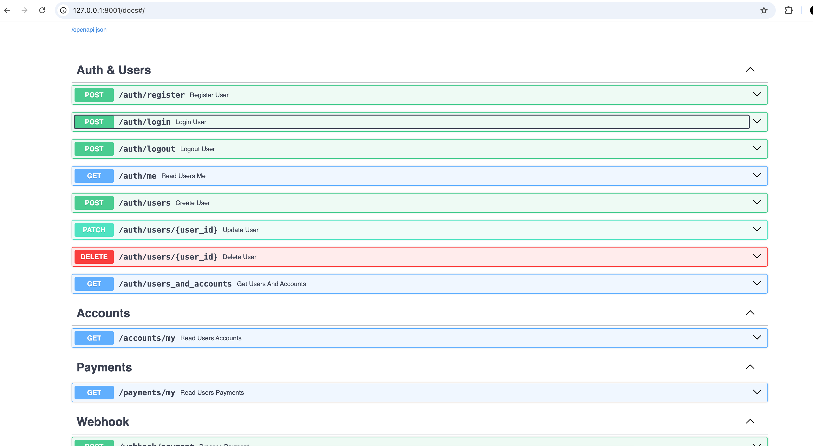

# FastAPI Приложение

## Учетные данные

**Пользователь:**  
Email: `testuser@example.com`  
Пароль: `testpassword`

**Администратор:**  
Email: `admin@example.com`  
Пароль: `adminpassword`

## Документация API

Для доступа к документации API откройте [http://127.0.0.1:8001/docs#/](http://127.0.0.1:8001/docs#/)


### Доступные эндпоинты

- **POST /auth/register** — Зарегистрировать пользователя  
- **POST /auth/login** — Авторизоваться (access token сохраняется в куки автоматически)  
- **POST /auth/logout** — Выйти из системы  
- **GET /auth/me** — Информация о текущем пользователе  
- **POST /auth/users** — Создание пользователя (для админа)  
- **PATCH /auth/users** — Обновление данных пользователя (для админа)  
- **DELETE /auth/users** — Удаление пользователя (для админа)  
- **GET /auth/users_and_accounts** — Получить всех пользователей с их аккаунтами  
- **GET /accounts/my** — Получить все мои аккаунты  
- **GET /payments/my** — Получить все мои платежи  
- **POST /webhook/payment** — Вебхук для обработки платежа

### Пример запроса для вебхука для тестового пользователя (при запуске с docker-compose):

```json
{
  "transaction_id": "23523662362",
  "account_id": 1,
  "user_id": 1,
  "amount": 130,
  "signature": "3d23ccd83ff15fb4fe5f3d78378b2b4af7f458a0d9f94775ab4e25db6cc6a53d"
}

```

Дальше стоит посмотреть платежи и счета пользователя


ДЛЯ ЗАПУСКА: <br>

с докером:
docker-compose up -d --build (.env.docker заранее будет заполнен, для экономии времени) <br> 

без докера:
устанавливаем виртуальное окружение и все зависимости <br>

создаём и заполняем .env (на примере .env.docker) и запускаем fastapi с командой uvicorn app.main:app --reload --port 8001
